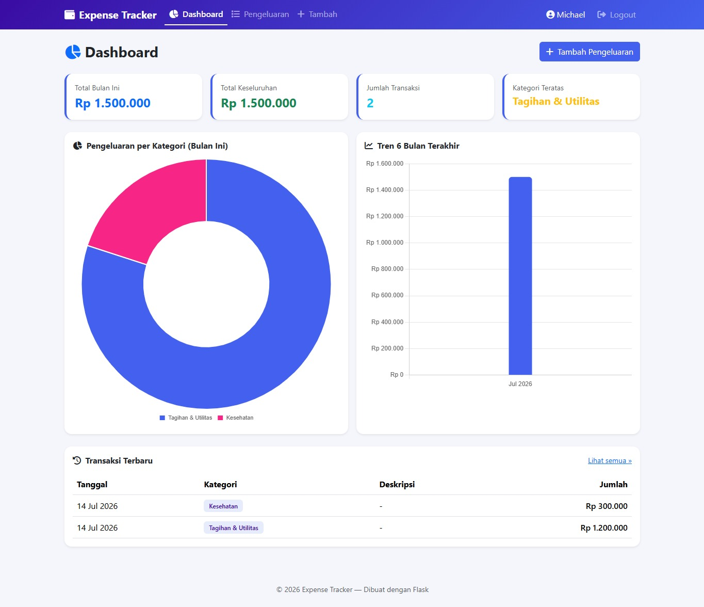
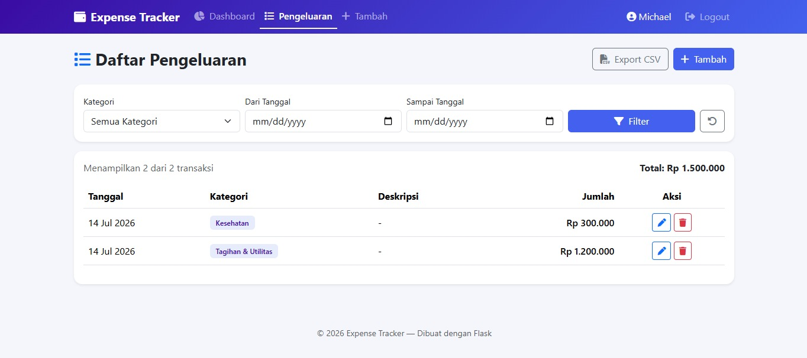
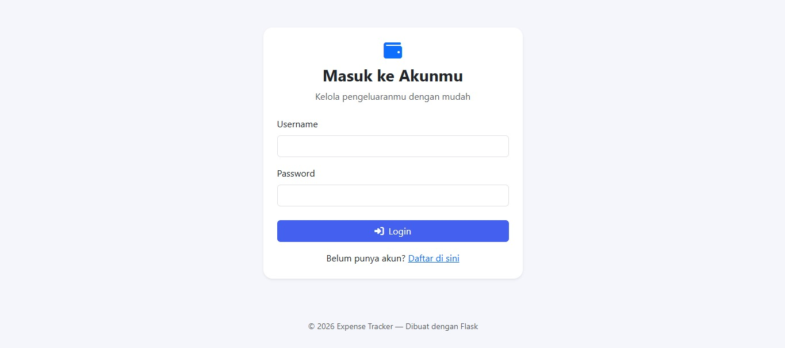
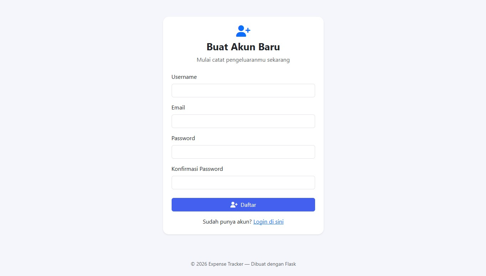

#  Expense Tracker

Aplikasi web untuk mencatat dan memvisualisasikan pengeluaran harian, dibangun dengan **Python + Flask**. Dilengkapi sistem autentikasi user (register/login), CRUD pengeluaran, filter & pagination, export CSV, serta grafik interaktif (Chart.js).

##  Fitur

- **Autentikasi User**: Register, login, logout dengan password ter-hash (Werkzeug), session via Flask-Login.
- **Manajemen Pengeluaran (CRUD)**: Tambah, lihat, edit, hapus data pengeluaran — setiap user hanya bisa melihat datanya sendiri.
- **Dashboard & Grafik**:
  - Kartu ringkasan: total bulan ini, total keseluruhan, jumlah transaksi, kategori teratas.
  - Pie/Doughnut chart: distribusi pengeluaran per kategori (bulan berjalan).
  - Bar chart: tren pengeluaran 6 bulan terakhir.
- **Filter & Pagination**: Filter berdasarkan kategori dan rentang tanggal, daftar pengeluaran dengan pagination.
- **Export CSV**: Unduh seluruh riwayat pengeluaran dalam format CSV.
- **Keamanan**: CSRF protection (Flask-WTF), validasi form, password hashing.
- **UI Responsif**: Bootstrap 5 + Font Awesome, tampilan mobile-friendly.

##  Tech Stack

| Layer          | Teknologi                          |
|----------------|-------------------------------------|
| Backend        | Python, Flask (Application Factory + Blueprint) |
| Database       | SQLite + Flask-SQLAlchemy (ORM)     |
| Auth           | Flask-Login, Werkzeug Security      |
| Form & Validasi| Flask-WTF, WTForms                  |
| Frontend       | Jinja2, Bootstrap 5, Chart.js       |

##  Struktur Project

```
expense_tracker/
├── app.py                 # Entry point (application factory)
├── config.py               # Konfigurasi app
├── extensions.py           # Inisialisasi db, login_manager, csrf
├── models.py                # Model User & Expense
├── forms.py                 # WTForms (Register, Login, Expense)
├── requirements.txt
├── routes/
│   ├── auth.py              # Register, login, logout
│   ├── expenses.py          # CRUD pengeluaran, filter, export CSV
│   └── dashboard.py         # Dashboard & API data grafik (JSON)
├── templates/
│   ├── base.html
│   ├── dashboard.html
│   ├── auth/
│   │   ├── login.html
│   │   └── register.html
│   └── expenses/
│       ├── list.html
│       └── form.html
└── static/
    └── css/style.css
```

##  Cara Menjalankan

1. **Clone / masuk ke folder project**
   ```bash
   cd expense_tracker
   ```

2. **Buat virtual environment (disarankan)**
   ```bash
   python -m venv venv
   source venv/bin/activate      # Linux/Mac
   venv\Scripts\activate         # Windows
   ```

3. **Install dependencies**
   ```bash
   pip install -r requirements.txt
   ```

4. **Jalankan aplikasi**
   ```bash
   python app.py
   ```

5. Buka browser ke `http://127.0.0.1:5000` — database SQLite (`instance/expense_tracker.db`) akan otomatis dibuat saat pertama kali dijalankan.

## 🔑 Alur Penggunaan

1. Buka `/register` untuk membuat akun baru.
2. Login di `/login`.
3. Tambahkan pengeluaran lewat tombol **"Tambah Pengeluaran"**.
4. Lihat ringkasan & grafik otomatis di **Dashboard**.
5. Kelola/edit/hapus data di halaman **Pengeluaran**, gunakan filter kategori/tanggal, atau export ke CSV.

##  Catatan Keamanan (Production)

- Ganti `SECRET_KEY` di `config.py` dengan nilai acak yang aman (gunakan environment variable).
- Set `debug=False` sebelum deploy.
- Pertimbangkan migrasi ke PostgreSQL/MySQL untuk skala produksi (tinggal ganti `SQLALCHEMY_DATABASE_URI`).
- Gunakan HTTPS dan `SESSION_COOKIE_SECURE=True` di production.

##  Kemungkinan Pengembangan Selanjutnya

- Budget/limit bulanan per kategori dengan notifikasi.
- Multi-currency support.
- Upload struk/bukti pengeluaran (attachment).
- API RESTful terpisah untuk integrasi mobile app.

## Screenshots




